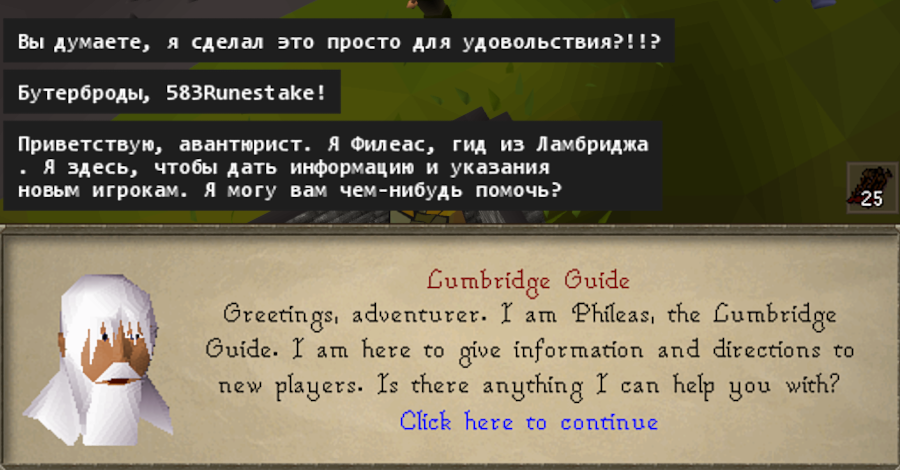
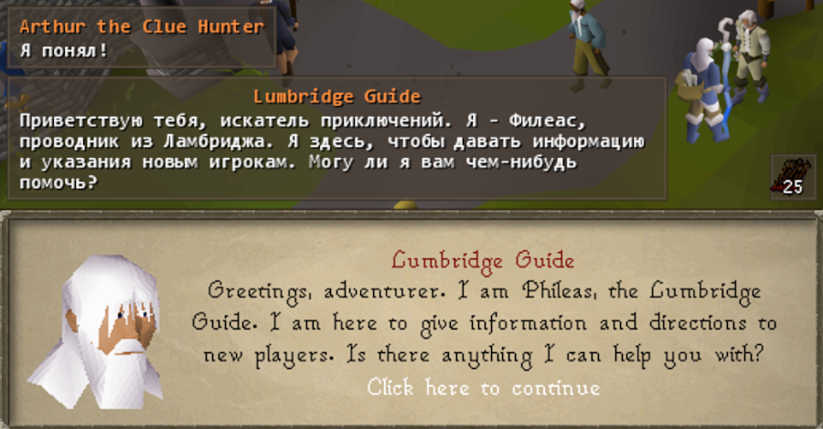
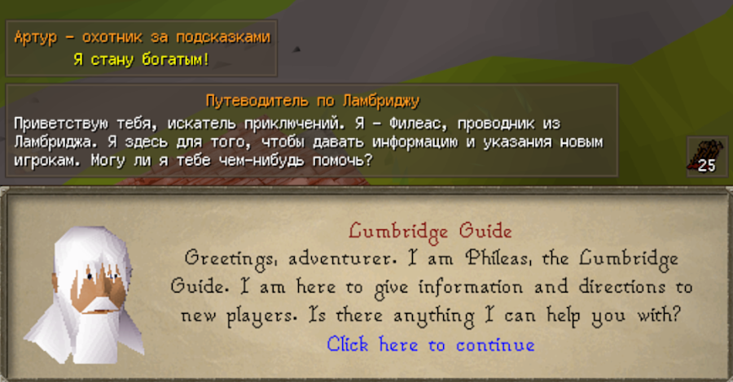

# Polywoof for RuneLite\

Translation **Framework** for **RuneLite** that can translate *ACTUALLY* everything[^1]!
**Widget Text** and **UI** are untouched to prevent confusion of misleading translations.
Support for any type of language characters[^2], including **Japanese**, **Chinese** and many others.
Embedded **H2 SQL** database[^3] with an organized schema for the supported languages and offline translations.

- [x] Translation for **NPC**, **Player** and other dialogs.
- [x] Translation for **Game Messages** and **Examines**.
- [x] Translation for **NPC** and **Item**[^4] names.
- [x] Translation for **Dialog Options**.
- [x] Translation for **Overhead Text**.
- [x] Translation[^5] for **Scrolls**, **Books**, **Player Messages** and _any text_ on the screen.

[^1]: Not interaction **Menus**, not **Stats**, not other basic **UI** elements.
[^2]: You may have to specify your own font via the config.
[^3]: Translations via **Quick Actions** won't be saved into the database, only temporarily.
[^4]: Only when you click **Examine**.
[^5]: Available only via the context menu of the **Quick Actions** button.

> [!NOTE]
> List of the [**Supported Languages**](src/main/resources/languages.json). 
> **H2 SQL** database is located at `~/.runelite/cache/polywoof.mv.db` in your **Home** directory. 

> [!TIP]
> Use [**DBeaver**](https://dbeaver.io/download), or a similar program to view or edit the database.

## Guide for DeepL

> [!NOTE]
> **API Key** is _REQUIRED_ for the **DeepL** backend! 
> **Best Quality** and very recommended, but not available in some regions.

- You have to register a [**DeepL**](https://www.deepl.com/signup) account, choose a _free_ or _paid_ [**DeepL API**](https://www.deepl.com/pro-api) plan, create an [**API Key**](https://www.deepl.com/your-account/keys) and copy it.
	- If you can't register or verify for any reason – ask someone to help you!
- Open the config and paste the key into the **API Key** field, type in your destination **Language** and choose whatever you want to be translated in the **Translation** section!
	- Any additional stuff will use your **API Quota**, so choose wisely.

## Guide for Google

> [!NOTE]
> **API Key** is _REQUIRED_ for the **Google** backend! 
> **Good Choice**, might withdraw your money if not careful.

- You have to create a [**Google Cloud**](https://console.cloud.google.com/freetrial) account, a [**Cloud Billing**](https://console.cloud.google.com/billing) account and link it to your default project.
- Enable the [**Translation API**](https://console.cloud.google.com/flows/enableapi?apiid=translate.googleapis.com), create an [**API Key**](https://console.cloud.google.com/apis/credentials/key) and copy it.
	- **Google** will charge you if the **API Quota** exceeds over **500,000** characters monthly, to prevent that visit the [**Translation API**](https://console.cloud.google.com/apis/api/translate.googleapis.com/quotas) and set _«v2 and v3 general model characters per day»_ to **16,000** _(500,000 ÷ 31)_.
- Open the config and paste the key into the **API Key** field, and you're done!

## Guide for MyMemory

> [!NOTE]
> **Free Service** _without any fees_! 
> **Great Solution** for everyone, has a lot of quota but not so perfect.

- You don't really have to do anything, just leave something in the **Email Address** field other than blank text.
	- Optionally, you can enter your email address for an additional **API Quota** of **50,000** _(instead of 5,000)_ characters per day.

## Frequently Asked Questions

- _Not working at all, nothing appears, nothing works._
	- You haven't set the required **API Key** in the config, or got a wrong one.
- _Can't see any words, squares appear but not text._
	- Your **Language** requires a different charset, try to change the **Font** or leave the field empty.
- _**DeepL** or **Google** are not available in my country, what should I do?_
	- I've pointed out in the **Guide**, you should ask your friends for help.
- _What happens when the quota exceed the limit?_
	- Nothing horrible if you have limited your **Google API** usage, but you have to wait till the ending of the month.
- _I've put everything in the config, but it's translating to **English**._
	- You've selected the wrong backend in the config, **Generic** backend for debugging purposes only.
- _How to change where the text boxes appear?_
	- Just like any other elements, hold the **Alt Key** and drag.
- _Can you add an **Interface** translation? Do you have a plan to make an **Unofficial** translation?_
	- The plugin is designed to be a quick-and-easy **Framework** and **Helper** for automatic translations that still require basic English knowledge, not a translation project. Although it's very possible to make it based on the plugin.
- _Please, add a different translation backend, like **ChatGPT**._
	- I've tried my best to make the code expandable, feel free to **Contribute**.
- _Some books, text or scrolls are not translating, can you translate these?_
	- The **UI** in this game is very unpredictable, you can translate these manually via the **Quick Actions**.
- _How to **Export** or **Transfer** my saved translations? How to share these with my friends?_
	- You have to copy the mentioned **H2 SQL** file to the same directory on another computer.

> [!IMPORTANT]
> If you've encountered any **Bugs** or need **Help** – please, join our [**Discord**](https://furfy.github.io/invite) server!

|  |  |  |
|:------------------------:|:--------------------------:|:-------------------------:|
|         _Early_          |         _Release_          |         _Rework_          |

*Люблю Дэйвика.. 💕* 
*Благодарности Эвилу за помощь! ✨*
